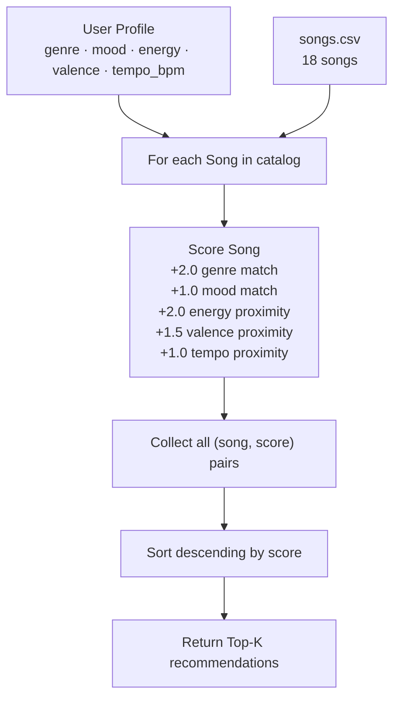

# 🎵 Music Recommender Simulation

## Project Summary

In this project you will build and explain a small music recommender system.

Your goal is to:

- Represent songs and a user "taste profile" as data
- Design a scoring rule that turns that data into recommendations
- Evaluate what your system gets right and wrong
- Reflect on how this mirrors real world AI recommenders

This simulation implements a content-based music recommender. Given a `UserProfile` that
describes preferred genre, mood, energy, valence, and tempo, the system scores every song in
`data/songs.csv` using a weighted proximity formula and returns the top matches. It is designed
to prioritize emotional context (energy + mood) over raw genre matching, reflecting how listening
sessions are driven more by the vibe you need than by a strict genre preference.

---

## How The System Works

Real-world music recommenders (Spotify, YouTube Music) build a mathematical fingerprint of both
each song and each listener, then measure how close those fingerprints are. At scale they blend
two strategies: *content-based filtering* (match song attributes to user taste) and
*collaborative filtering* (find users with similar history and borrow their discoveries). This
simulation focuses on the content-based half — it scores every song by how well its measurable
attributes match the user's stated preferences, then surfaces the highest-scoring tracks.

What this version prioritizes: matching the **emotional context** of listening (are you working
out, studying, or unwinding?) over pure genre loyalty. Energy and mood are weighted heavily
because getting those wrong makes a recommendation feel jarring, even if the genre is right.

---

### Data Flow



---

### `Song` features used

| Feature | Type | Weight | Why it matters |
|---|---|---|---|
| `genre` | categorical | +2.0 on match | Strongest intent signal — listeners self-sort by genre |
| `mood` | categorical | +1.0 on match | Sets the emotional context of the listening session |
| `energy` | 0–1 float | up to +2.0 | Determines listening context — wrong energy kills the experience |
| `valence` | 0–1 float | up to +1.5 | Musical positiveness; predicts emotional lift or melancholy |
| `tempo_bpm` | integer | up to +1.0 | Granular rhythm feel; normalized over 200 bpm before comparing |

### `UserProfile` stores

- `genre` — preferred genre string (e.g. `"pop"`)
- `mood` — preferred mood string (e.g. `"happy"`)
- `energy` — target energy level, 0–1 float
- `valence` — target musical positiveness, 0–1 float
- `tempo_bpm` — target beats per minute (integer)

### Finalized Algorithm Recipe

```
score(song) =
    2.0  if song.genre == user.genre                            (genre match)
  + 1.0  if song.mood  == user.mood                            (mood match)
  + (1 − |song.energy   − user.energy|)   × 2.0               (energy proximity)
  + (1 − |song.valence  − user.valence|)  × 1.5               (valence proximity)
  + (1 − |song.tempo/200 − user.tempo/200|) × 1.0             (tempo proximity)
```

Maximum possible score ≈ **7.5 points**. Categorical bonuses only fire on exact string match;
numerical terms use linear proximity so the score peaks at 0 distance and falls off as the gap
grows.

### Ranking Rule

Apply the Scoring Rule to every song → sort descending → slice top-K. The ranking step is kept
separate from scoring so diversity filters (e.g., "no two songs from the same artist") can be
injected at ranking time without touching the score math.

---

### Expected Biases

- **Genre dominance:** a +2.0 flat bonus can out-score a near-perfect energy match (+1.9 pts),
  so the system may overlook a phenomenal song in the wrong genre.
- **Mood is coarse:** the catalog uses only 8 mood strings; two "chill" songs can feel very
  different in practice (ambient vs. lofi), but the system treats them identically.
- **Catalog skew:** with 18 songs, any under-represented genre (classical, metal) has fewer
  chances to appear even when the user's numerical features align well.
- **No listening history:** the profile is hand-crafted; real systems infer preferences from
  thousands of implicit signals the user never consciously states.

---

## Getting Started

### Setup

1. Create a virtual environment (optional but recommended):

   ```bash
   python -m venv .venv
   source .venv/bin/activate      # Mac or Linux
   .venv\Scripts\activate         # Windows
   ```

2. Install dependencies

   ```bash
   pip install -r requirements.txt
   ```

3. Run the app (classic mode — no API key needed):

   ```bash
   python -m src.main
   ```

### AI Mode Setup

AI mode sends your natural-language query to Claude, which parses it into a
structured profile and then re-ranks the weighted-scorer candidates using
musical reasoning.

1. Copy `.env.example` to `.env`:

   ```bash
   cp .env.example .env
   ```

2. Add your Anthropic API key to `.env`:

   ```
   ANTHROPIC_API_KEY=sk-ant-...
   ```

   Get a key at <https://console.anthropic.com>.

3. Run with a natural-language query:

   ```bash
   python -m src.main --mode ai --query "something chill for late-night studying"
   python -m src.main --mode ai --query "pump-up gym playlist, maximum energy"
   python -m src.main --mode ai --query "melancholy rainy day indie vibes"
   ```

   If the API is unavailable, the system automatically falls back to the weighted
   scorer and labels the results accordingly.

### Running Tests

```bash
pytest
```

Tests in `tests/test_recommender.py` cover the core weighted scorer.
Tests in `tests/test_ai_recommender.py` cover the AI layer with mocked API
calls — no API key required.

---

## Experiments You Tried

Five profiles were tested. Terminal output for each is shown below.

### Profile 1 — High-Energy Pop Fan

```
────────────────────────────────────────────────────────────
  PROFILE: High-Energy Pop Fan
  genre=pop  mood=happy  energy=0.9  valence=0.85
────────────────────────────────────────────────────────────
  1. Sunrise City  —  Neon Echo          Score: 7.27
  2. Gym Hero  —  Max Pulse              Score: 6.30
  3. Rooftop Lights  —  Indigo Parade    Score: 5.14
  4. Riddim Season  —  Tropicana         Score: 4.44
  5. Ultraviolet Drop  —  Bassline Theory Score: 4.34
```

### Profile 2 — Chill Lofi Studier

```
────────────────────────────────────────────────────────────
  PROFILE: Chill Lofi Studier
  genre=lofi  mood=chill  energy=0.38  valence=0.6
────────────────────────────────────────────────────────────
  1. Library Rain  —  Paper Lanterns     Score: 7.41
  2. Midnight Coding  —  LoRoom          Score: 7.36
  3. Focus Flow  —  LoRoom               Score: 6.44
  4. Spacewalk Thoughts  —  Orbit Bloom  Score: 5.13
  5. Coffee Shop Stories  —  Slow Stereo Score: 4.25
```

### Profile 3 — Deep Intense Rock

```
────────────────────────────────────────────────────────────
  PROFILE: Deep Intense Rock
  genre=rock  mood=intense  energy=0.95  valence=0.4
────────────────────────────────────────────────────────────
  1. Storm Runner  —  Voltline           Score: 7.29
  2. Gym Hero  —  Max Pulse              Score: 4.79
  3. Iron Storm  —  Rageform             Score: 4.17
  4. Ultraviolet Drop  —  Bassline Theory Score: 3.75
  5. Night Drive Loop  —  Neon Echo      Score: 3.74
```

### Edge Case — Conflicted Raver (high energy + melancholy mood)

```
────────────────────────────────────────────────────────────
  PROFILE: Conflicted Raver (edge case)
  genre=edm  mood=melancholy  energy=0.95  valence=0.25
────────────────────────────────────────────────────────────
  1. Ultraviolet Drop  —  Bassline Theory Score: 5.60  ← genre+energy wins
  2. Iron Storm  —  Rageform             Score: 4.24
  3. Storm Runner  —  Voltline           Score: 4.02
  4. Crossroads Lament  —  Blue Delta    Score: 3.77  ← only melancholy song
  5. Gym Hero  —  Max Pulse              Score: 3.64
```

**Finding:** When a user has conflicting categorical preferences (edm genre + melancholy
mood), the genre bonus wins. Crossroads Lament — the only song with the matching mood — ranked
4th because its energy (0.30) was a terrible numerical match for a user targeting 0.95.

### Edge Case — Classical Explorer

```
────────────────────────────────────────────────────────────
  PROFILE: Classical Explorer (edge case)
  genre=classical  mood=peaceful  energy=0.2  valence=0.75
────────────────────────────────────────────────────────────
  1. Moonlight Reverie  —  Klassik Krew  Score: 7.44
  2. Spacewalk Thoughts  —  Orbit Bloom  Score: 4.17
  3. Coffee Shop Stories  —  Slow Stereo Score: 3.98
  4. Library Rain  —  Paper Lanterns     Score: 3.94
  5. Focus Flow  —  LoRoom               Score: 3.79
```

### Weight Experiment — doubled energy, halved genre

Applied to the High-Energy Pop Fan profile. Changed `genre` weight: 2.0 → 1.0, `energy`
weight: 2.0 → 4.0.

```
════════════════════════════════════════════════════════════
  EXPERIMENT: doubled energy weight, halved genre weight
════════════════════════════════════════════════════════════
  1. Sunrise City  —  Neon Echo          Score: 8.11  (unchanged #1)
  2. Gym Hero  —  Max Pulse              Score: 7.24  (unchanged #2)
  3. Rooftop Lights  —  Indigo Parade    Score: 6.86  (unchanged #3)
  4. Ultraviolet Drop  —  Bassline Theory Score: 6.24  (↑ from #5)
  5. Storm Runner  —  Voltline           Score: 5.79  (new! was not in top 5)
     Riddim Season fell out — energy match too weak at the new 4× multiplier
```

Storm Runner (rock, energy=0.91) entered the pop fan's top 5 because the 4× energy
multiplier gave it 3.96 pts on energy alone, more than enough to compensate for losing the
genre bonus.

---

## Limitations and Risks

- Catalog has only 18 songs; niche genres (classical, metal, blues) have 1 song each
- Mood vocabulary is coarse — two "chill" songs can feel very different
- Genre flat bonus (+2.0) can override a nearly-perfect numerical match in a different genre
- No memory: the system cannot learn from repeated listens

You will go deeper on this in your model card.

---

## Reflection

[**Full Model Card →**](model_card.md)

Building VibeFinder made clear that recommender systems are not mysterious — they are
weighted scorecards applied at scale. The surprising part was how *plausible* the outputs
felt for well-formed profiles, not because the math is clever, but because the chosen
features (energy, valence, mood) genuinely capture the same dimensions listeners use to
describe their taste. A chill lofi listener and a high-energy pop listener use completely
different words to ask for music, but both can be served by the same five-number formula
once you measure the right things.

Bias showed up in two concrete ways. First, genre count imbalance: pop and lofi have
3 catalog entries each while classical, metal, and blues have only 1 — so niche users have
structurally fewer chances to earn the genre bonus, and the system is simply worse at
serving them. Second, the flat genre bonus (+2.0) can override a much better emotional
match in a different genre, which is how the "Conflicted Raver" profile ended up with a
euphoric EDM track instead of the one melancholy song it was actually asking for. Both of
these patterns exist in real production systems at larger scale — the lesson is that the
data you train on and the weights you choose always reflect someone's priorities, even when
the math looks neutral.


---

## 7. `model_card_template.md`

Combines reflection and model card framing from the Module 3 guidance. :contentReference[oaicite:2]{index=2}  

```markdown
# 🎧 Model Card - Music Recommender Simulation

## 1. Model Name

Give your recommender a name, for example:

> VibeFinder 1.0

---

## 2. Intended Use

- What is this system trying to do
- Who is it for

Example:

> This model suggests 3 to 5 songs from a small catalog based on a user's preferred genre, mood, and energy level. It is for classroom exploration only, not for real users.

---

## 3. How It Works (Short Explanation)

Describe your scoring logic in plain language.

- What features of each song does it consider
- What information about the user does it use
- How does it turn those into a number

Try to avoid code in this section, treat it like an explanation to a non programmer.

---

## 4. Data

Describe your dataset.

- How many songs are in `data/songs.csv`
- Did you add or remove any songs
- What kinds of genres or moods are represented
- Whose taste does this data mostly reflect

---

## 5. Strengths

Where does your recommender work well

You can think about:
- Situations where the top results "felt right"
- Particular user profiles it served well
- Simplicity or transparency benefits

---

## 6. Limitations and Bias

Where does your recommender struggle

Some prompts:
- Does it ignore some genres or moods
- Does it treat all users as if they have the same taste shape
- Is it biased toward high energy or one genre by default
- How could this be unfair if used in a real product

---

## 7. Evaluation

How did you check your system

Examples:
- You tried multiple user profiles and wrote down whether the results matched your expectations
- You compared your simulation to what a real app like Spotify or YouTube tends to recommend
- You wrote tests for your scoring logic

You do not need a numeric metric, but if you used one, explain what it measures.

---

## 8. Future Work

If you had more time, how would you improve this recommender

Examples:

- Add support for multiple users and "group vibe" recommendations
- Balance diversity of songs instead of always picking the closest match
- Use more features, like tempo ranges or lyric themes

---

## 9. Personal Reflection

A few sentences about what you learned:

- What surprised you about how your system behaved
- How did building this change how you think about real music recommenders
- Where do you think human judgment still matters, even if the model seems "smart"

